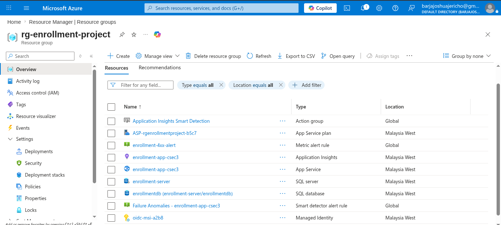
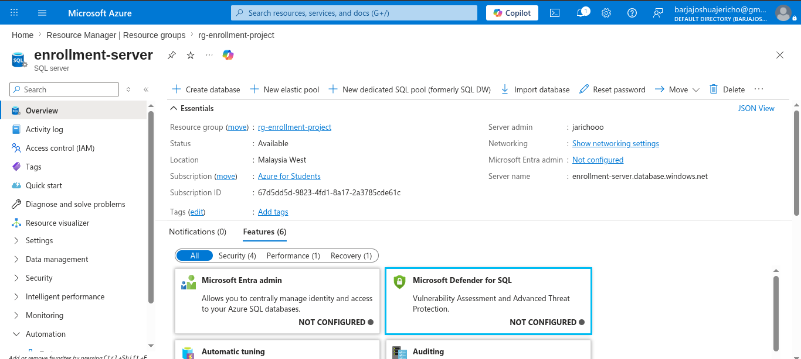
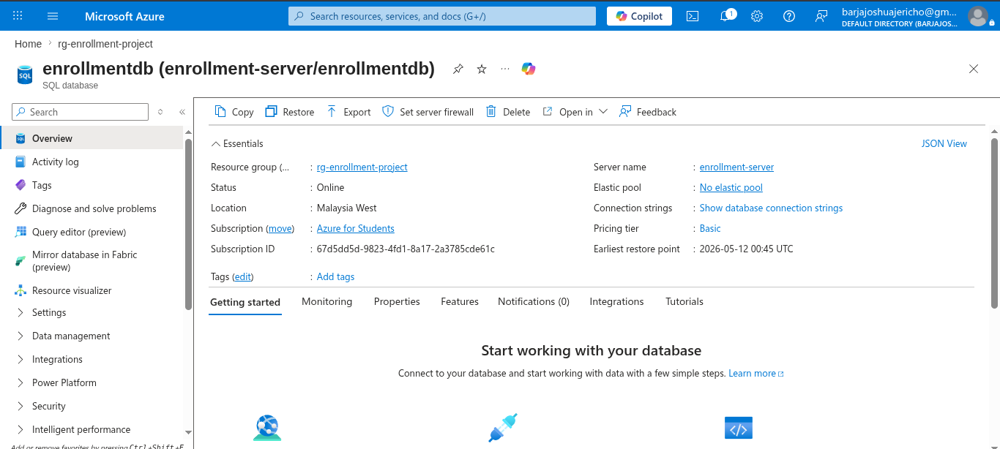
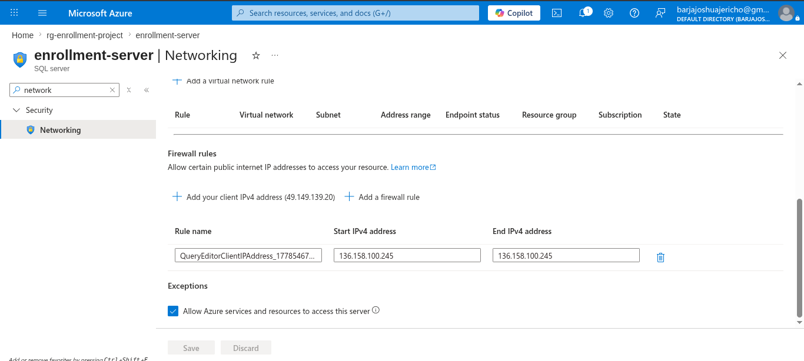
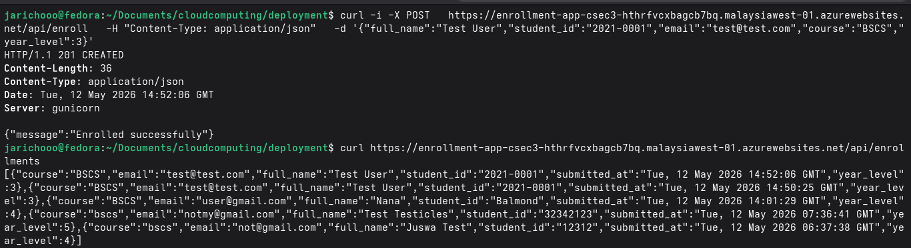
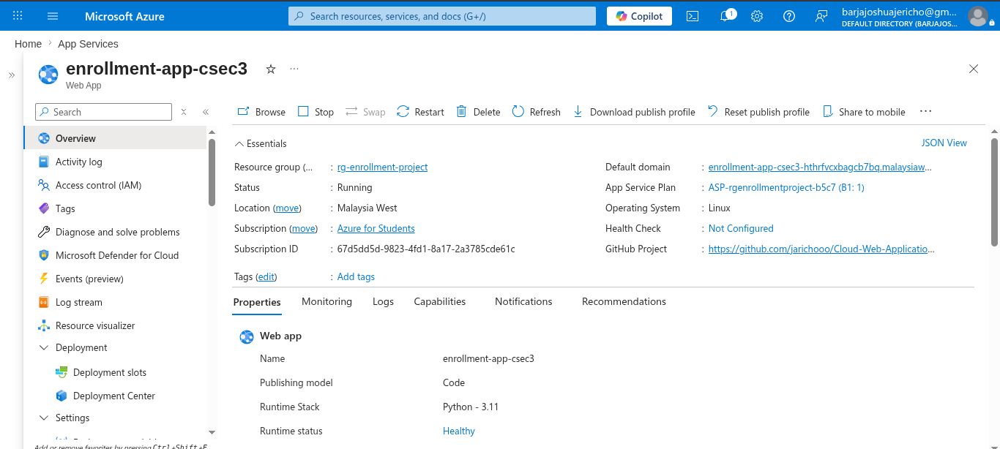
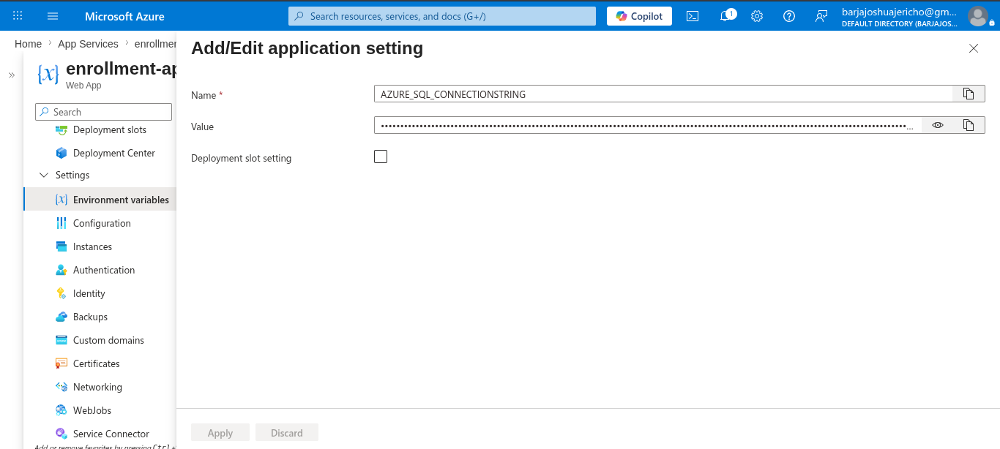
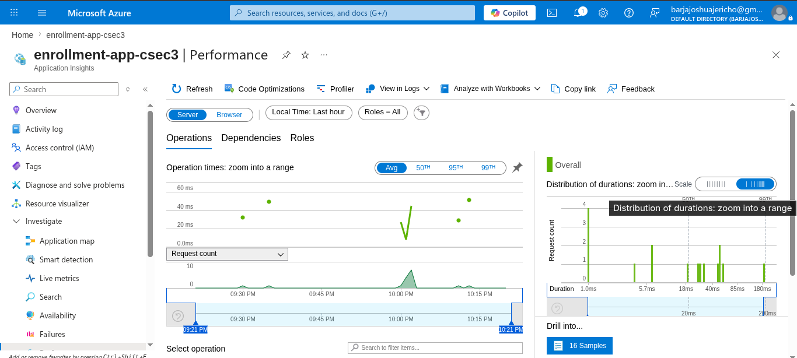
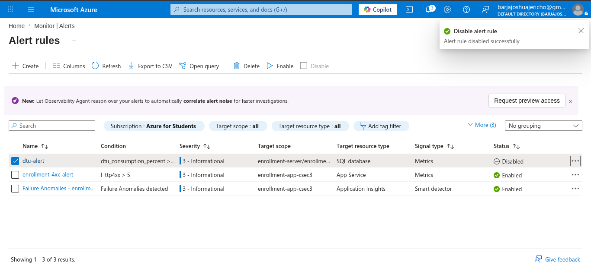
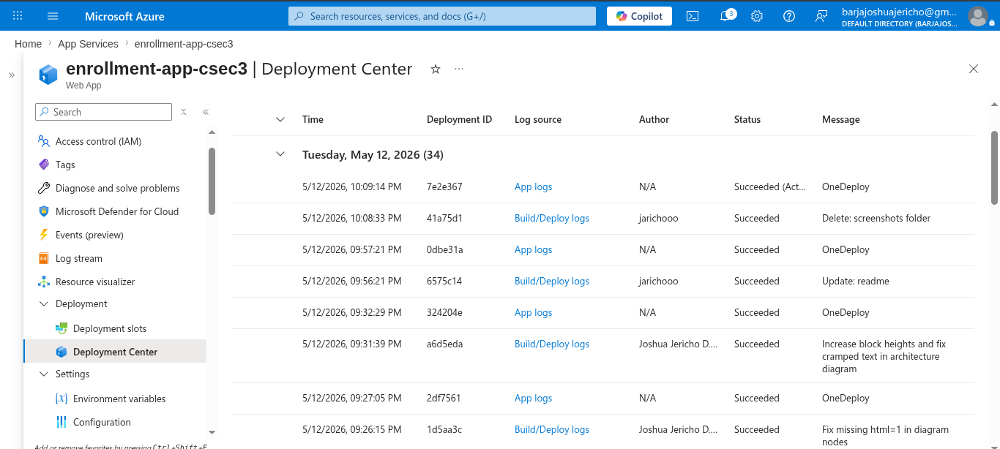

## Azure Resource Deployment Steps (GUI)

The following steps outline the process taken to provision the Azure infrastructure for the Student Enrollment System using the Azure Portal.

### 1. Set up the Resource Group
* **Resource Group:** Created a new Resource Group named `rg-enrollment-project`.
* **Region:** Selected `Malaysia West` as the primary region for all resources.

  
### 2. Provision the Azure SQL Database
* **SQL Server & Database:** Created a new Azure SQL Server (`enrollment-server`) and a database named `enrollmentdb`.
* **Compute Tier:** Selected the **Basic DTU** tier (5 DTUs, 2GB Storage) for cost-effective hosting.

* **Verification:** Validated that the SQL server was deployed successfully.
  
  
  

* **Networking & Security:** 
  * Navigated to the SQL Server's Networking settings.
  * Enabled **"Allow Azure services and resources to access this server"** so the App Service can connect, while denying external public access.
  
  

* **Testing Connection:**
  * Tested the database connectivity from Azure.

  

### 3. Set up the App Service (Web App)
* **Web App Creation:** Created a new Web App named `enrollment-app-csec3`.
* **App Service Plan:** Set up `ASP-rgenrollmentproject` with the **Basic B1** pricing tier on Linux.
* **Runtime Stack:** Selected **Python 3.11**.
  
  

### 4. Configure Application Settings & Connection Strings
* **Environment Variables:** Set up the necessary connection strings for the App Service so that it knows how to authenticate and talk to the `enrollmentdb` SQL database.

  

### 5. Enable Monitoring & Telemetry
* **Application Insights:** Created an Application Insights resource and linked it to the Web App for real-time monitoring and exception tracking.
  
  

* **Azure Monitor / Alerts:** Configured Metric Alerts and Smart Detection to trigger email notifications based on resource health.
  
  

### 6. Set up Continuous Deployment (CI/CD)
* **Deployment Center:** Navigated to the Deployment Center within the Web App.
* **Source Control:** Selected **GitHub** and authorized the connection.
* **Repository & Branch:** Selected the `jarichooo/Cloud-Web-Application-Deployment-on-Azure` repository and the `main` branch to generate the GitHub Actions workflow file.

  
